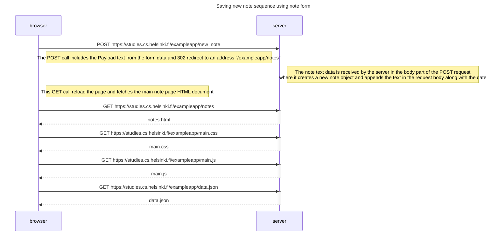

```mermaid
sequenceDiagram
    participant browser
    participant server

    title Saving new note sequence using note form

    browser->>server: POST https://studies.cs.helsinki.fi/exampleapp/new_note
    Note right of browser: The POST call includes the Payload text from the form data and 302 redirect to an address "/exampleapp/notes"

    Note right of server: The note text data is received by the server in the body part of the POST request <br/> where it creates a new note object and appends the text in the request body along with the date


    Note right of browser: This GET call reload the page and fetches the main note page HTML document
    
    browser->>server: GET https://studies.cs.helsinki.fi/exampleapp/notes
    activate server
    server-->>browser: notes.html
    deactivate server

    browser->>server: GET https://studies.cs.helsinki.fi/exampleapp/main.css
    activate server
    server-->>browser: main.css
    deactivate server

    browser->>server: GET https://studies.cs.helsinki.fi/exampleapp/main.js
    activate server
    server-->>browser: main.js
    deactivate server

    browser->>server: GET https://studies.cs.helsinki.fi/exampleapp/data.json
    activate server
    server-->>browser: data.json
    deactivate server
```