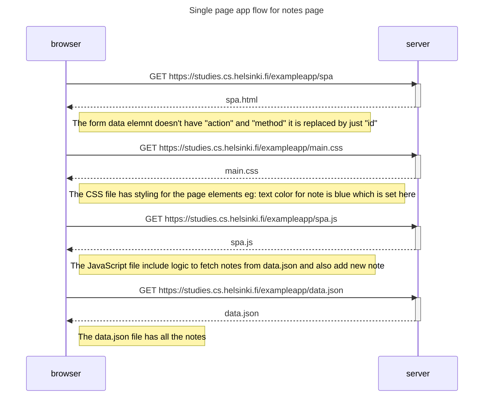

```mermaid
sequenceDiagram
    participant browser
    participant server
    title Single page app flow for notes page

    browser->>server: GET https://studies.cs.helsinki.fi/exampleapp/spa
    activate server
    server-->>browser: spa.html
    deactivate server

    Note right of browser: The form data elemnt doesn't have "action" and "method" it is replaced by just "id"

    browser->>server: GET https://studies.cs.helsinki.fi/exampleapp/main.css
    activate server
    server-->>browser: main.css
    deactivate server

    Note right of browser: The CSS file has styling for the page elements eg: text color for note is blue which is set here

    browser->>server: GET https://studies.cs.helsinki.fi/exampleapp/spa.js
    activate server
    server-->>browser: spa.js
    deactivate server

    Note right of browser: The JavaScript file include logic to fetch notes from data.json and also add new note

    browser->>server: GET https://studies.cs.helsinki.fi/exampleapp/data.json
    activate server
    server-->>browser: data.json
    deactivate server

    Note right of browser: The data.json file has all the notes
```