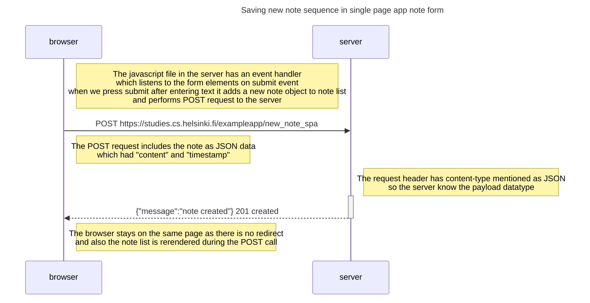

```mermaid
sequenceDiagram
    participant browser
    participant server

    title Saving new note sequence in single page app note form

    Note right of browser: The javascript file in the server has an event handler <br/> which listens to the form elements on submit event <br/> when we press submit after entering text it adds a new note object to note list <br/> and performs POST request to the server

    browser->>server: POST https://studies.cs.helsinki.fi/exampleapp/new_note_spa
    Note right of browser: The POST request includes the note as JSON data <br/> which had "content" and "timestamp"

    Note right of server: The request header has content-type mentioned as JSON <br/> so the server know the payload datatype
    activate server
    server-->>browser: {"message":"note created"} 201 created
    deactivate server

    Note right of browser: The browser stays on the same page as there is no redirect <br/> and also the note list is rerendered during the POST call

```